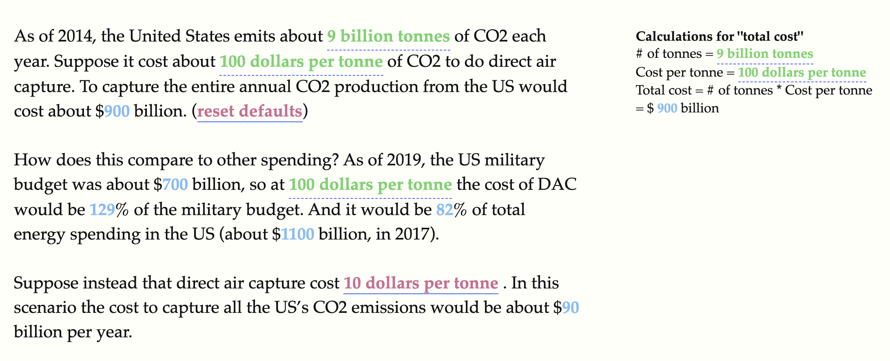

# Tangle style reactive documents

This is my attempt to get a document that somewhat replicates Bret Victor's tangle functionality. 
Specifically trying to get something that can look like the section here http://worrydream.com/ClimateChange/#media-debate.

## Dependencies
There are two different sources I'm using to get the effect I want.
- curvenote (https://curvenote.dev/) is doing all of the actual heavy lifting to make things reactive. 
- tuffte css (https://github.com/edwardtufte/tufte-css) is being used to get the calculations to show up to the side of the text.

## Result

